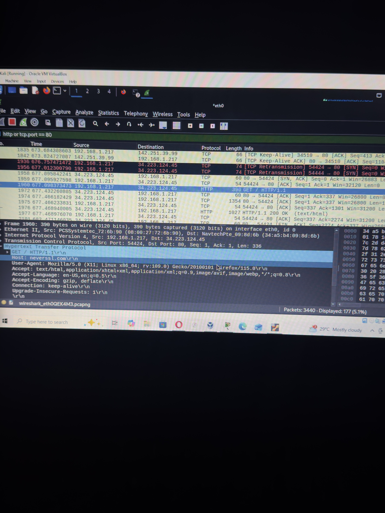
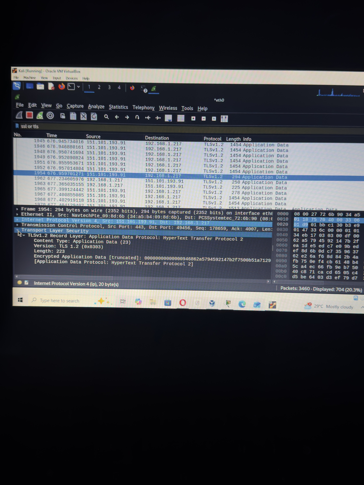

# Home Network Security Assessment

## Overview
Real world vulnerability assessment performed on home network using Kali Linux, Nmap and Wireshark to identify security risks and analyse network traffic.

## Tools Used
- **Nmap** — Network scanner and vulnerability detector
- **Wireshark** — Protocol analyzer and packet capture
- **Kali Linux** — Security focused Linux distribution

## Network Scanning with Nmap
Performed network reconnaissance on home network to discover active devices and open ports.

**Command used:**
nmap -sn 192.168.1.0/24

nmap -A 192.168.1.1

**Devices Discovered:**
- 192.168.1.1 — Airtel 4G Router (JBoneOS)
- 192.168.1.217 — Kali Linux Machine

## Vulnerability Assessment Results

| Port | Service | Version | Risk Level |
|------|---------|---------|------------|
| 22/tcp | SSH | Dropbear 2017.75 | Medium |
| 23/tcp | Telnet | Open | High |

## Risk Analysis

### Port 22 — SSH (Medium Risk)
- Running Dropbear SSH version from 2017
- 8 year old version with known vulnerabilities
- Could be brute forced by attackers

### Port 23 — Telnet (High Risk)
- Transmits ALL data including passwords in plain text
- No encryption whatsoever
- Anyone capturing network traffic can read credentials

## Traffic Analysis with Wireshark

### HTTP Traffic (Unencrypted)
- Captured plain text HTTP traffic from neverssl.com
- GET requests fully visible and readable
- Demonstrates danger of unencrypted communication

### HTTPS/TLS Traffic (Encrypted)
- Captured TLS encrypted traffic from google.com
- Only shows Opaque type, Version and Length
- Content completely unreadable — encryption working correctly

## Screenshots

## Recommendations
1. Disable Telnet service on router
2. Update router firmware to latest version
3. Replace ISP provided router with personal router
4. Use SSH instead of Telnet for all remote access
5. Always use HTTPS websites over HTTP

## Key Learnings
- Real world routers often have security vulnerabilities
- ISP provided routers may have locked settings preventing remediation
- Encryption makes network traffic completely unreadable to attackers
- Nmap and Wireshark are essential SOC analyst tools
